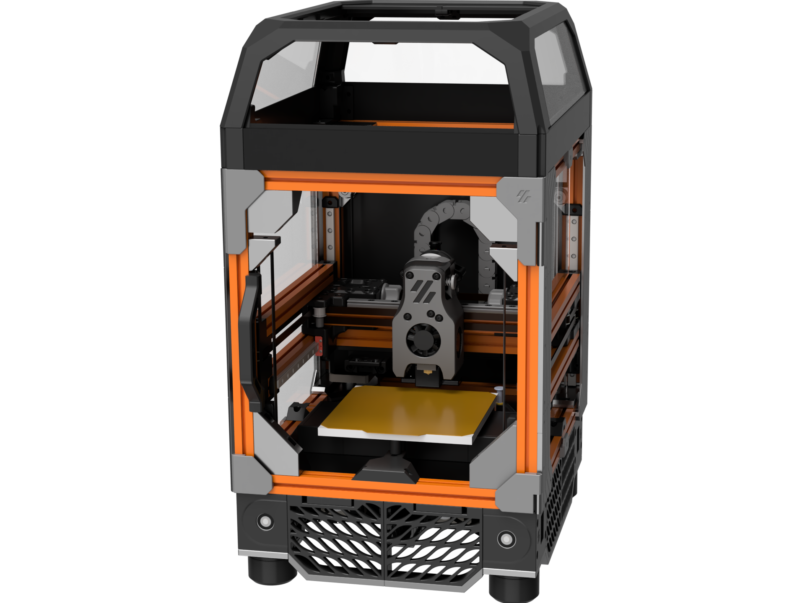

# F-Zero - an Evolved Voron Zero

by Zruncho and `#flying-zero` collaborators on the [DoomCube Discord](https://discord.gg/doomcube):
L.e.o.p.a.r.d, finn, Kayos Maker, hartk, ericsson, sci, and more.

**Upgrade your V0 or build a fresh F0.**

**Full auto-calibration at a fraction of the price of a V2.**

**Make every first layer perfect!**

### → [See one in action!](https://youtu.be/jLSPeJ7L9R4)  (V0.802 Serial Request)
### → [See CAD in your browser!](https://grabcad.com/library/f-zero-cad-1)
### → [Parts List!](https://docs.google.com/spreadsheets/d/1EkonubBAvg1huz3OgxQa6iyDdansaWyFQbpp1GPkiBE/edit#gid=0): delta relative to V0.1
### → [Get Support!](https://discord.gg/doomcube) (#flying-zero on DoomCube Discord)

Join us on the [DoomCube Discord](https://discord.gg/doomcube) for the latest info and any questions.

### Buildlog and Design Doc

[See the Assembly Manual and Buildlog Gdoc](https://docs.google.com/document/d/1dm8itefYrLIsCcOQht9sdMzrXE8Jk30s56c9IwtRCkM/edit#heading=h.c4f5tznx0p31) for more details.

This doc currently has all assembly notes - **definitely check it out if you're considering a build.**

## Goal

**Build a flying-gantry printer using v0 Components.**

**Or put another way**: mod the V0 into a flying-gantry CoreXY printer.

**Why?**  Why not?  Main reason: fun.

* **More fun to build.**
    * It’s a longer but easier build.  Everything is pretty straightforward to put together.  With printed corners, you can remove any single extrusion at any time to add nuts later without huge pain.
* **More fun to run.**
    * Quad Gantry Leveling is a huge Quality-of-life bonus.  No manual bed tramming is needed!
    * Automatic Z Calibration is a nice Quality-of-life bonus.  No work when switching out flexplates of varying height, changing nozzles, or just doing maintenance.
* **More fun to mess with.**
    * This is a fun way to try out new software features and mods, with a faster iteration cycle.  Think of it as a low-cost “V2 trainer” or a fully-evolved V0.  
* **More affordable.**
    * All the features of a V2 at ½ or ⅓ the cost.  ~$200 or less to upgrade a V0.

Other benefits:
* **More-scalable build.**  
    * Untested currently, but 150x150x150 or even 180x180x120 may be doable without huge mods, and this should enable a nice upgrade path for V0s or larger builds.
* **No Z wobble**.
    * Belt drives prevent Z wobble and make for easier sourcing.
* **Reuses much of the V0 ecosystem**
    * Reuses gantry improvements (like MGN9 and dual MGN7 rails), tophat designs, LED mounts, frame kits, toolhead mods… tons of stuff.

### Status Updates

* **2022-03-06**: At least six are printing, or have printed.  Other F0 builds are underway!  All parts + CAD to build your own are available.  Why the lack of major updates?  Because this thing works... that's why.  Everything is out there for you to make your own, and has been for months.

* 2022-02-21: F0.002 is going strong, beyond 350 hrs of printing without a rebuild.  
* 2021-11-24: Updated NEMA17 motor mounts + CAD available now.
* 2021-11-23: Sci fixed an issue with the 2xMGN7 carriage mount.  Thanks!
* 2021-11-20: Side-panel STLs added to GitHub.  Print with concentric infill for extra style.
* 2021-11-15: Congrats Electroleon on getting an F-Zero printing!  Blueberry filament looks awesome.
* 2021-11-02: Fastener list added to BOM.  Tentative total: 533 fasteners (ignores some reused V0 parts though, so lower delta in practice).
* 2021-10-20: Congrats on an awesome printer printing, EG!
* 2021-10-19: BOM moved to GSheet and updated with fastener info.  Not done yet, though.
* **2021-10-17: Full CAD (well, everything but fasteners) added to GitHub.**
* 2021-10-17: New Z joints, with KGLM-03 joints headed to GitHub.  Sources noted below too.
* 2021-10-05: Lots of parts added or moved around in GitHub, including many electronics spacers, the gantry wire organizers, and more.
* 2021-09-25: [Zerofilter](https://github.com/zruncho3d/zerofilter) released!  A filter that fits in the tightest of spaces, including under F-Zero’s bed.  See
* 2021-09-23: [Second serial request]((https://www.reddit.com/r/voroncorexy/comments/ptrhjn/serial_request_v01_fzero_discord_ericsson4763/) and Youtube video is up!  Congrats Ericsson!  Sweet printer with nice customized skirts, mini display, and panels.
* 2021-09-21: [First serial request](https://www.reddit.com/r/voroncorexy/comments/pt235s/serial_request_v01_zruncho1790_fzero_a_flying/) and Youtube videos are up!  \
 [https://www.reddit.com/r/voroncorexy/comments/pt235s/serial_request_v01_zruncho1790_fzero_a_flying/]
* 2021-09-17: Sample Klipper configs will have a mix of Protoloft’s Z-Calibration and Klicky macros.  Full auto-calibration is working nicely now.
* 2021-09-14: See ``#zero-filter` on the DoomCube discord: filter designed
* 2021-09-06: New front skirts designed, which match the rears.  
* 2021-09-06: F-Zero-Orange prints!!!  Also - it’s enclosed, too.
* 2021-08-29: Lots of new parts designed and tested, including a magnetic-attach rear-of-gantry wiring unit and Z chain attachments.  
    * Bottom 1515 attachment for 75%-size Panzer chain
    * Top attachment for 75%-size Panzer chain
    * Simple between-AB-drive box to hide 2 stepper motor connectors + Y endstop and receive the toolhead wires, then send them to the 75%-size Panzer chain
* 2021-08-20: Side skirts fit, and work nicely with existing, unmodified V0 side panels.  They require a bit of printing, but nobody will mistake your printer for anything else.  Top extensions - to the frame, the side panels, and the top panel, to cover all gaps for existing, unmodified V0 side panels - will be added to the GitHub repo soon.
* 2021-08-15: In-progress CAD made available on Discord
* 2021-08-08: Side skirts added.
* **2021-08-02:** Another one prints!  Congrats, ericsson!
* 2021-08-01: Another one QGLs! Congrats, ericsson - your Black Frame / Orange Accent F-Zero is a thing of beauty.  I’m sure printing will come soon.
* 2021-07-27: Gantry attachments updated again on GitHub, to preemptively avoid flex from MGN7 carriages.
* 2021-07-20: Gantry attachments updated on GitHub.
* 2021-07-13: Moving to Klicky for autoprobing.  BOM now up-to-date.  Parts by Kayos, soon.
* 2021-07-11: F-Zero#2 with printed corners is coming to life shortly… stay tuned!
* 2021-07-08: Printable baseplate designed and tested.
* 2021-07-07: Extrusion-oriented bed mount (“space invaders”) designed and tested.
* 2021-07-03: It’s my go-to printer now.  This printer has not had a failed print yet.
* 2021-07-03: Added NEMA17 motor option and bugfix for NEMA14 mounts on GitHub
* **2021-06-26:** First print!  A poker chip, but it’s a start.  Calibration needed, for sure.
* 2021-06-26: Back from some work focus.  Time to validate the toolhead.
* 2021-06-09: Corner joint STLs added to [https://github.com/zruncho3d/f-zero](https://github.com/zruncho3d/f-zero)
* 2021-06-07: STLs released to [https://github.com/zruncho3d/f-zero](https://github.com/zruncho3d/f-zero)  
* 2021-06-04: New Z joints working well for QGL
* 2021-06-01: New Z joints designed, using hobby spherical joints pressed into plastic holders.  Untested but looking good.
* 2021-05-31: First QGL, using Euclid probe!  Not 100% repeatable due to gantry-magnet alignment, but works.
* 2021-05-25: Gearboxes and belt blocks finalized, probe mount added, electronics mounted.  Getting close!
* 2021-05-18: Initial BOM added.
* 2021-05-16: Complete frame built.  See below.
* 2021-05-12: Partially designed, partially built.  See below.
* 2021-05-12: `#flying-zero` on DoomCube Discord added.
* 2021-05-01: Zruncho has Idea for F0, motivated by Hartk’s Micron render, and starts CAD and concepts.
* 2021-04-30: Hartk1213 [shares a render](https://discord.com/channels/460117602945990666/635687829254701107/837819803241545769 ) of what will become Micron on #voronuser_mods

### Parts in this Repo

In this repo are all the STLs you need to make an F-Zero, except for:
- Voron 0.0 or 0.1 parts, including gantry, toolhead, carriage retainers, tophat, and M2 nutbars
- Z endstop (see #micron-v2 on DoomCube Discord)

All parts should be already be in print-ready orientation, and no supports are needed.

Standard Voron settings, or lowered infill and fewer perims, should work fine for most parts:
- 3-4 perimeters
- 16-40% infill, depending on the part
- 0.4-0.5mm width
- 0.2mm layer height

Exceptions include:
- Frame Corners: print at 5 or 6 perimeters, 10% infill, 0.16mm layer height (seriously)
- Electronics Mezzanine Spacers: print at 3 perimeters, 0% infill, 0.2 layer height
- NoDropNuts: print at 3 perimeters, 0% infill, 0.2 layer height

### FAQ

#### Q: F-Zero vs Micron… what’s the difference?

If you're asking this question, you should probably visit the [3D Printers for Ants](https://3dprintersforants.com/) website first, to see a visual landscape of the latest small printers.

To answer your question though... **at a high level, F-Zero and Micron have the same idea:** take the best quality-of-life features from larger printers, and put them on a small printer.

Both have ~120mm-on-a-side build space, use 1515 extrusions, use Klicky and 4 Z motors and belt reduction to enable QGL, have NEMA14-size motors on the gantry, and use the MiniAB from the V0.1 - **but each has a completely opposite execution.**

Hartk took the Voron 2.4 design and scaled it down to create Micron.  It looks like a V2, but smaller.  

Zruncho took the V0 design and wrapped it in a box to create F0.

Micron lives in its own ecosystem, with the V0 toolhead being the only shared item.

F0 lives within the existing V0 ecosystem (the gantry is unchanged!), so you can use existing V0 kits and parts, including LDO color frames, pre-cut panels, toolhead and umbilical boards, and more.  With almost 1500 serial’ed V0s as of March 2022, **this is a huge ecosystem**.  Your wallet gets to benefit from the price competition between suppliers that is only possible with a large ecosystem.  Your printer gets to benefit from the innovative new products that often emerge to support large market: things like easier-to-assemble [visible-joint frames](https://www.aliexpress.com/item/1005003198676826.html), super-solid [metal X-carriages](https://www.aliexpress.com/item/1005003371851612.html), and more.  This attribute is true for any V0-based mod, including [Tri-Zero](https://github.com/zruncho3d/tri-zero), [Double Dragon](https://github.com/zruncho3d/double-dragon), and any others.

**Size?**  From a size perspective, Micron is wider than a V0 or F0 by 20mm, while F0 is deeper by 50mm than both V0 and Micron.  Really, though, they’re both pretty small.  The V0 design is extremely space-efficient in the XY direction, while Micron uses a wider V2-style gantry that removes the need for two extra extrusions.

**Parts?** Nearly all non-printed parts, minus the frame, are shared between the two designs, but nearly all printed parts are different, with the exception of the MiniAB toolhead, which both share with the V0.

**Prints?** Both can print amazingly well and fast, and should scale similarly to larger sizes.

**Documentation?** Micron has its own manual, while F0 has build notes and is able to reuse much of the V0 manual.

**The Takeaway:** If you already have a V0, and want to do an upgrade, F0 is a great option, as it retains more of a V0 kit; you won’t need to waste money on new panels or a new frame, and you'll have fewer parts to print.

It’s more of a personal preference for fresh builds.

#### Q: Can I get a Voron Serial for my printer?

A: Absolutely! The Voron Team is great about supporting heavily modified printers, as long as they carry the essence of the originals (Zruncho’s view, not an official line).  

A successful serial request grants access to Voron Owners Club Discord channels and more: see [the Truth about Voron Owners Club](https://www.reddit.com/r/voroncorexy/comments/q1gk2e/the_truth_about_the_voron_owners_club_voc/).

You can learn a lot from checking out these serial videos and the corresponding reddit discussions:

* [Serial Request - V0.1 zruncho#1790 (F-Zero: a Flying Voron Zero)](https://www.reddit.com/r/voroncorexy/comments/pt235s/serial_request_v01_zruncho1790_fzero_a_flying/)
* [Serial Request V0.1 - F-Zero Discord: ericsson#4763](https://www.reddit.com/r/voroncorexy/comments/ptrhjn/serial_request_v01_fzero_discord_ericsson4763/)

#### Q: Can I just increase the height of the vertical extrusions and skip the printing and sourcing for a tophat?

Absolutely.  Just make sure to increase the height of your panels to go with it.

#### Q: What’s the deal with X carriage options?

V0.1 carriages inform the design of any F-Zero carriages, and you have at least two choices currently, both contributed by Kayos Maker, with the 2xMGN7H option fixed by sci.   

Context, first: on the stock V0.1, a symptom called “toolhead flop” is common, and the root cause is a combination of (1) significant toolhead weight on a long-ish lever arm, at least relative to the rail width, and (2) low-cost MGN7 rails that tend to be loose (low preload).

You can ignore toolhead flop and may still see high-quality prints, especially with the input shaper tuned in Klipper, with accelerations set to low (say, sub-3K) values, and/or with high preload rails (hard to find, $$).  

However, it seems better to reduce the potential for hotend motion to create print artifacts or (F-Zero-specific) probing inaccuracies, and just go with a single larger MGN9C rail or two MGN7 rails.

##### 1xMGN9C

MGN9C rails fit in nearly the same space as MGN7H (only a few mm wider at the carriage, but not longer) and they’re a low-cost, easy way to reduce toolhead flop.  This option has been used on at least FZ.002 with success.

If using this option, ideally you’ll need to create extra space for the slightly-thicker carriage of an MGN9. Either:

* (Preferred, if it clears) Tighten screws with the MGN9 holes offset to get about 0.5mm of Y offset
* Use modified V0 AB blocks with a bit of extra setback, [like these from nchiu](https://github.com/nhchiu/VoronMods/tree/main/V0/X_axis_MGN9C) or [like these (from VoronMods)](https://github.com/VoronMods/V0/tree/main/2nd_X_rail_for_V0.1_mini_AB/)
* Add spacers, such as 2x M3x6 BHCS with spacing nuts in the X gantry extrusion, facing the motor blocks
* Add [printed spacers from the F-Zero repo](https://github.com/zruncho3d/f-zero/blob/main/STLs/Gantry/mgn9_spacer_x2.stl), and mount them with 4x M3x6 BHCS

##### 2xMGN7H on opposite sides

Doubling the MGN7 rails is another option, and it’s known to provide a meaningful reduction in flop, with a few downsides:

* the extra area can potentially block hotend-cooling airflow
* parallel rails require proper alignment
* extra weight from two rails
* you lose ~1 mm of Y travel for the extra space by which the MGN7H carriage sticks out from the extrusion

If the spacing between the carriages is too small, this part will add significant preload to the rails, potentially causing them to bind.  When printing in ABS, the part will shrink (measured by sci and zruncho to reduce from 31mm to ~30.7mm), and this shrinkage needs to be taken account to avoid binding. \
 \
Props to sci on Discord for diagnosing and fixing this problem with [PR #2](https://github.com/zruncho3d/f-zero/pull/2), which adds space between the carriages to reduce the potential for binding.

This option has been used on at least FZ.000 with success, even without added space.

##### 2xMGN7H with orthogonal mount {#2xmgn7h-with-orthogonal-mount}

VoronMods [has a double-X mod](https://github.com/VoronMods/V0/tree/main/2nd_X_rail_for_V0.1_mini_AB), but it would need a carriage update to provide a Klicky mount.

#### Q: What bed space do I lose, relative to a V0?

You’ll lose a tiny bit near the (x=120, y=120) corner due to having an endstop there.  If using an overhanging sexbolt endstop, you’ll lose 0 mm of Y travel.  If using a non-overhanging one, you’ll lose a few MM of Y travel as a result, because the nozzle needs space to press down.

You’ll lose about 1.5mm of Y travel if using the MGN9C option but not using modified AB blocks.

You’ll lose a chunk in the (x=0, y=120) corner due to having the Klicky mount there on all options.

If that’s too much, there’s at least one modded MiniAB which supports an inductive probe, which doesn’t cause any loss of travel.

#### Q: What stuff _don’t_ I need from a V0.1 kit if going straight to a fresh F0 build?

The vast majority of **non-printed** stuff is reused.  Exceptions include:

* bed springs (x3)
* integrated-leadscrew stepper and nut
* various fasteners used for attaching Z-drive components and the frame

The vast majority of **printed** stuff is reused, too.  Exceptions include:

* all Z-drive parts
* skirts
* X carriage mount (needs one with a Klicky mount)

#### Q: Why?  A: Why not?

#### Q: Why not a V1 then?  A: No leadscrew wobble. Auto-calibration. Cost.

#### Q: But isn’t there a belted V0 mod already that ditches leadscrew? A: Yes.

It’s from [thefpvgeek](https://github.com/theFPVgeek/VoronUsers/tree/master/printer_mods/theFPVgeek/v0-zbelt-mod), it’s great, and Zruncho used to use it.  But you still need to manually calibrate.  Z carriage screws are still hidden and a pain to retighten.

#### Q: Can build a larger F0?  A: Yes, with work.

The design should support at least up to 50mm extra travel in each dimension, as a fully boxed frame, printed frame corners, and fully-supported bed yield a printer much more rigid than a regular V0.  An “F-Zero Plus” with +50mm in some or all dimensions would be a great printer.  A +50mm-X, +50mm-Y variant might even use some off-the-shelf beds which provide ~170mm of printable space in each dimension.

You’ll need to do a little bit of work and buy different parts.

If unenclosed:

* Modify baseplate with extra width and length (straightforward in CAD: split, extrude, join)
* Modify rear separator with extra width and length
* Source longer rails
* Source longer extrusions
* Modify or find longer skirts
* Source/build a larger bed and larger heater
    * Need more power if using a DC bed instead of AC w/SSR

If enclosed:

* Modify/use tophat extensions or just use longer Z extrusions and no tophat
* Use larger side panels
* If larger Z, modify side enclosure pieces.

If that’s too much work, consider other Voron-derived/inspired small-printer choices at [www.3dprintersforants.com](www.3dprintersforants.com).  

#### Q: Aren’t lead screws, especially the integrated ones with V0.1, just fine?  A: Yes.

Lead screws are fine.  A stock V0 prints amazingly well.  QGL is a quality-of-life improvement, but by ensuring calibration, is also a quality-of-printing improvement too.

#### Q: Well, what are the downsides?  A: Cost + complexity.

* Cost of additional components: 3x additional motor drivers + board + belts + pulleys + probe switch.
* Additional build time for each Z drive.
* Additional overall complexity and stuff to break.

#### Q: So it’s more expensive, for the same print volume, with greater complexity? A: Yes.

If you’re on a budget and optimizing for print volume or simplicity, there are many other choices for you.

If you like the idea of automatic bed tramming, this may be for you.

#### Q: I want to build one.  How can I learn more?  A: A few ways.

* Go to `#flying-zero` on the [DoomCube Discord](https://discord.gg/doomcube).  Share your idea and progress there!

#### Q: Can I apply the Double Dragon mod to an F-Zero?  A: Yes, with lots of work, and you might regret it.

[Double Dragon](https://github.com/zruncho3d/double-dragon) is a Voron Zero mod to add Independent Dual Extrusion (IDEX) to a V0-size printer (called “X0”).  By default, X0 adds 100mm of width, while F-Zero adds 50mm of depth.

In theory, you could combine these two mods… but:

* You’d have to merge the F0 corner joint design with the X0 Y drive idlers, and this would likely give up Z travel.
* The Y-drive steppers are lower in X0, so they’d smack into the rear baseplate.
* The added weight means you’d need to use beefy motors, probably mid to large-size NEMA17s.
* The baseplate would need to be widened, and any X0 panels deepened.

If you really want X0 with automatic bed leveling, [Tri-Zero](https://github.com/zruncho3d/tri-zero) is probably a better choice, because the extra weight of the longer X rail and additional toolhead is borne by the frame, not a flying gantry.

#### Q: Why do the idlers have formed threads, vs the usual heatsets?  A: Alignment.

The formed thread helps to ensure that the idler stays perfectly parallel to the drive pulley; heatsets enable misalignment, and this is one place you don’t want misalignment causing premature belt wear.

